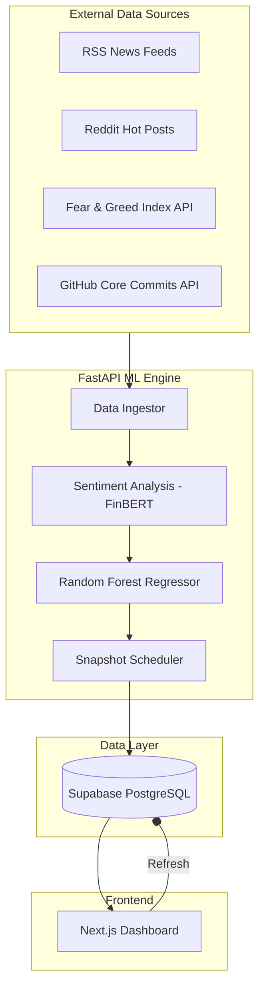
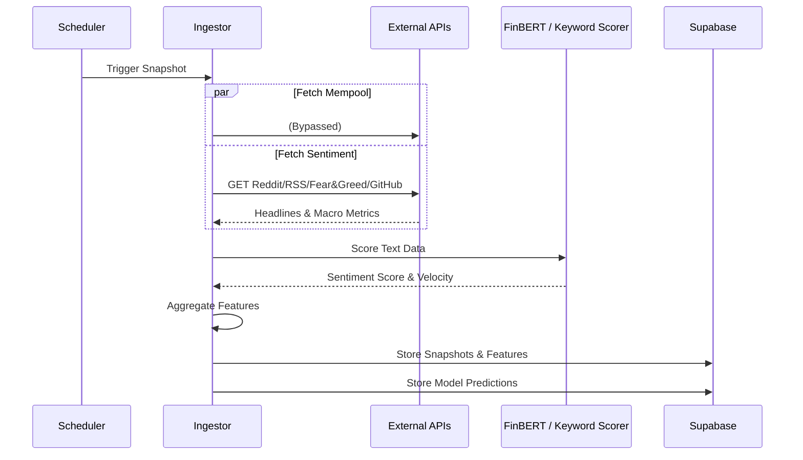
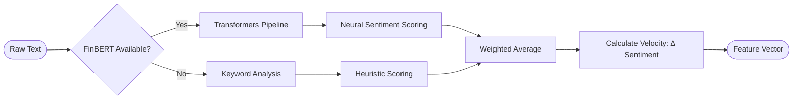

# SenticPulse System Architecture & Workflow

This document explains the technical inner workings of the Mempool Sentiment Engine, detailing how data flows from external sources into our predictive models and finally to the dashboard.

## 1. High-Level System Overview

The system is composed of three main layers: **Data Ingestion**, **ML Processing**, and **Dashboard Visualization**.



---

## 2. The Data Ingestion Pipeline

Every 5 minutes, the system triggers a snapshot process that gathers data from multiple vectors.



---

## 3. Sentiment Analysis Workflow

We use a hybrid approach to ensure high uptime and accuracy.



---

## 4. ML Prediction Logic

The prediction engine uses a **Random Forest** model trained on specific market "regimes" (temporal windows).

```mermaid
graph LN
    F1[TX Count] --> Input
    F2[Median Fee] --> Input
    F3[Sentiment Score] --> Input
    F4[Sentiment Velocity] --> Input
    F5[Temporal Flags: Peak/Weekend] --> Input
    
    subgraph Input [Feature Vector]
    end
    
    Input --> Scaler[Standard Scaler]
    Scaler --> RF[Random Forest Forest]
    
    RF --> P1[Next Block Estimate]
    RF --> P2[3-Block Estimate]
    RF --> P3[6-Block Estimate]
    
    P1 & P2 & P3 --> Confidence[Confidence Calculation]
    Confidence --> Output([Final Dashboard JSON])
```

---

## 5. Technical Component Breakdown

###  Data Ingestor
- **Social Connectors**: Uses `feedparser` for 7 expanded RSS feeds and `httpx` for public Reddit JSON endpoints.
- **Macro & Momentum**: Integrates `alternative.me` for the Fear & Greed Index and the GitHub API for Bitcoin Core developer momentum.

###  Processing & ML
- **FinBERT**: A specialized NLP model pre-trained on financial text. It understands nuance (e.g., "SEC delays ETF" is negative, while "SEC approves ETF" is positive).
- **Synthetic Fallback**: If external APIs are down, a **Stateful Markov Simulation** generates realistic data based on 2026 fee layers to keep the system alive.
- **Random Forest**: Chosen for its robustness against outliers and ability to handle the non-linear relationship between news sentiment and fee spikes.

###  Persistence (Supabase)
- **Time-Series Snapshots**: Every 5 minutes of Bitcoin history is preserved.
- **Relational Integrity**: Features are linked to snapshots, and predictions are linked to features, allowing for detailed backtesting and retraining.

###  Frontend (Next.js)
- **Real-time Updates**: Polls the Supabase layer to reflect the latest snapshots.
- **Visualization**: Uses `recharts` for historical trends and `framer-motion` for smooth UI transitions.
